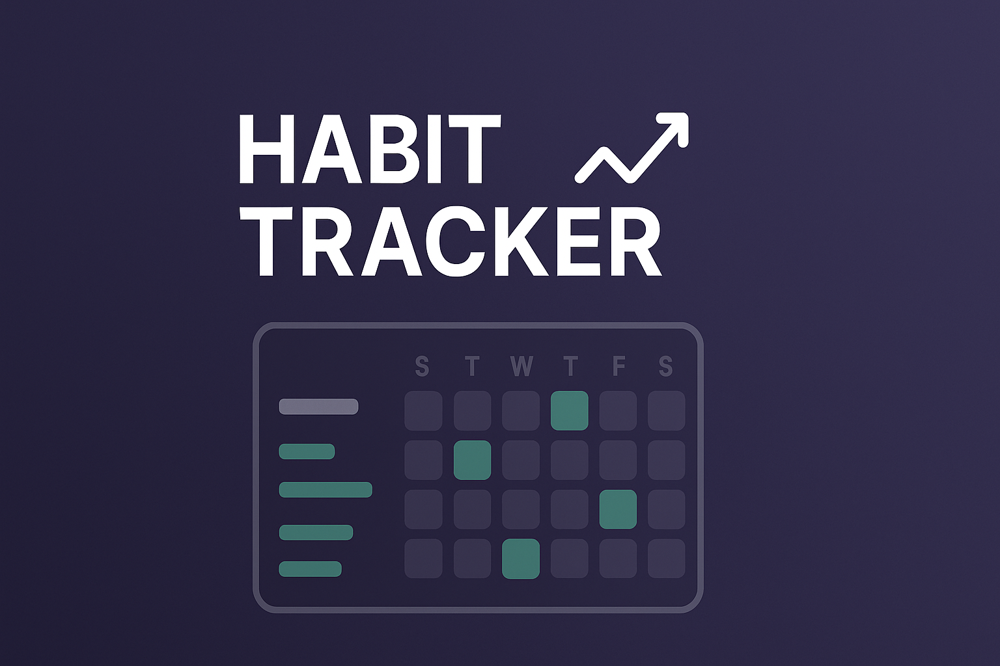

<p align="center">
  
</p>
# Habit Tracker 📈

Este projeto foi desenvolvido durante a **Next Level Week** da [Rocketseat](https://rocketseat.com.br) — um evento totalmente gratuito, online e prático que tem como objetivo impulsionar desenvolvedores de todos os níveis ao próximo estágio da sua jornada.

## 📚 Sobre o Projeto

O **Habit Tracker** é uma ferramenta de acompanhamento de hábitos, criada com o propósito de ajudar usuários a manterem suas resoluções e metas ao longo do ano. Nele é possível registrar hábitos diários, visualizar o progresso ao longo do tempo e ter um controle visual sobre a evolução da rotina.

Durante **5 dias de aula intensiva**, o projeto foi construído com foco em boas práticas, componentização e integração entre tecnologias modernas, resultando em uma aplicação completa com versão **web**, **mobile** e **back-end**.

- 🎨 Layout disponível no Figma: [Figma NLW](https://www.figma.com/community/file/1195326661124171197/habits-i)

## 🚀 Tecnologias e Ferramentas

- **React**  
- **React Native**  
- **Node.js**  
- **TypeScript**  
- **Vite**  
- **Tailwind CSS**  
- **Prisma ORM**  
- **SQLite**  
- **Fastify**  
- **Expo**

## 🧠 O que aprendi

- Estruturação de projetos **fullstack** com front-end, mobile e back-end integrados  
- Criação de aplicações web e mobile com **React** e **React Native**  
- Utilização do **TypeScript** para maior segurança e produtividade  
- Componentização e reutilização de elementos com React  
- Criação de **APIs REST** com **Node.js** e **Fastify**  
- Integração com banco de dados usando **Prisma ORM**  
- Estilização rápida e responsiva com **Tailwind CSS**  
- Organização de rotas e controle de estado da aplicação  

## 🛠️ Como rodar o projeto

### Pré-requisitos

- [Node.js](https://nodejs.org)
- [Git](https://git-scm.com)
- [Expo Go](https://expo.dev/client) instalado no seu celular ou emulador Android/iOS

### 📦 Clonando o repositório
```bash
git clone https://github.com/arrudax/habits-nlw.git
cd habits-nlw
```

🔁 Inicializando submódulos
```bash
git submodule init
git submodule update
```

⚙️ Executando o servidor (Back-end)
```bash
cd server
npm install
npx prisma generate
npx prisma db push
npx prisma db seed
npm run dev
```

💻 Executando a aplicação Web
```bash
cd ../web
npm install
npm run dev
```

📱 Executando a aplicação Mobile
```bash
cd ../mobile
npm install
npx expo start
```

✨ Resultado Final
A aplicação entrega uma experiência visual atrativa e intuitiva para acompanhamento de hábitos, com um dashboard responsivo e animações suaves tanto no app web quanto no mobile.

🙌 Créditos

Este projeto foi desenvolvido com base nas aulas da NLW Setup da Rocketseat, com orientação de Diego Fernandes.
